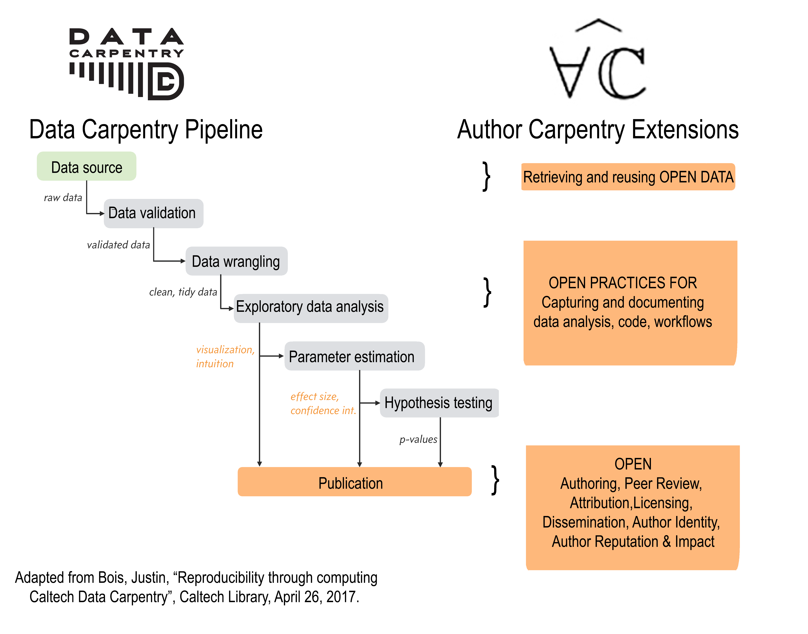

# Handout with Exercises

{width=400px}

---

## Exercise A: RMarkdown set up

1. In your `datacarpentry` directory within RStudio, create new folder called **reports**  
2. Step back up to main directory (where the fildes from Donna's lessons reside) and open file `03-R_Notebooks.RMD`   
3. Save as `Report01.Rmd` in the **reports** folder  
4. Open `Report01.Rmd` and review the YAML metadata at the top. Edit as follows:  
- Change author name to your name  
- Change report title to something that makes sense  
- Add a date entry in the format  
- Change output from `html_notebook` to `html_document`  

> *What change was made in the Preview button above?*

5. Run `sessionInfo()` to see what packages are installed. Make sure `tidyverse` and `rmarkdown` and `knitr` are installed

6. Return to YAML header and add two additional outputs for `word_document` and `slidy_presentation`.
Note changes to the Knit button above!

7. Knit the report to Word

8. Knit the document to Slidy slides

## Exercise B: Enhancing RMarkdown for more functional outputs

1. Change all of the section headers in the original document to Level One
2. In the header for Learning Objectives, revise to *Learning Objectives Unordered*
3. Remove all the `>` characters for blockquote
4. In front of each bulleted learning objective, insert an asterisk and a space
5. Copy the Learning Objectives Unordered section and paste it below
6. Change bullets before each learning objective to the numeral `1` and a space
7. Knit the report to HMTL

> *How does the choice of bullet characters affect the type of list displayed?*

## Exercise C: Enhancing RMarkdown for even more functional outputs

1. Above the Learning Objects sections, insert a new level one header *Preface*
2. At the bottom of the document, insert a new level one header *references*
3. Open up the *preface.txt* file included in the download 
4. Mark up this section with at least the following elements:
- hyperlink to Donald Knuth's Wikipedia entry -- you'll need to fetch this yourself!
- citation to Literate Programming book cover included in the bibtex file as 'knuth2018'
- blockquote 
- citation to Knuth's quote, included in the bibtex file as 'knuth1984' BUT without his name in the inline cite
- superscript to make 21st century look extra hip!
5. Add an entry for the bibliography up in the YAML metadata
6. Knit the report to HTML, Word, and Slidy

> *What happened to the References?*

## Exercise D: Cleaning up a bit before we go further...

1. Remove all the other text from the original notebook but leave the original code blocks

## Exercise E: Enhancing YAML metadata to add additional structural features to the outputs

1. Return to the YAML section up top and enhance the html output with the following elements:
- Add a table of contents
- Float the table of contents
2. Knit to a format of choice and admire your amazing progress!

{width=200px}

# Exercise F: Embedding technical expressions
1. Add a new level one header for *Technical Expressions*
2. Add two level two headers for *Math Formulas* and *LaTeX Expressions*, respectively
3. Copy code from the file **expressions.txt** and paste into these sections with the correct markdown tagging 
4. Knit to check your work!

# Exercise G: Embedding inline code (Oh, and a quick look at a crude Markdown table)
1. Add a new level one header for *Inline Code*
2. Copy code from the file **time.txt** and paste it into these sections with the correct markdown tagging 

> *Challenge: Can you revise your YAML header so your document always displays the current date*

# Exercise G: Embedding code chunks in your report
## Code chunk options
1. You have two ways to set chunk options that control how the chunk behaves and displays when knit:
- Set global chunk options at the top of your report using the chunk
- Set chunk options as you go
2. Set up a global chunk option for your report so that chunks always evaluate, the code and results display on knit, and warning messages are hidden.
3. On one of Donna's original code chunks, specify that the chunk should not display the R code that generated the result
4. Knit to HTML to view the results of different code chunk options

## Code chunks to display data as a table
1. Load package and library 'babynames`
2. Print the top 10 rows of the data as a table in your report
3. Create a smaller table of max 20 rows using some of your  tidyverse skillzzzz
4. Now try using the knitr function 'kable' to generate a more jazzy data table for your report:
kable(smaller-dataset, format = "markdown", align="l", padding=30, caption = "Pick Something Pithy")
5. Knit and admire your advanced RMarkdown knowledge!!!

## Challenge: Plot the distribution of your name over time and include as a code chunk. Knit and share with the class!

